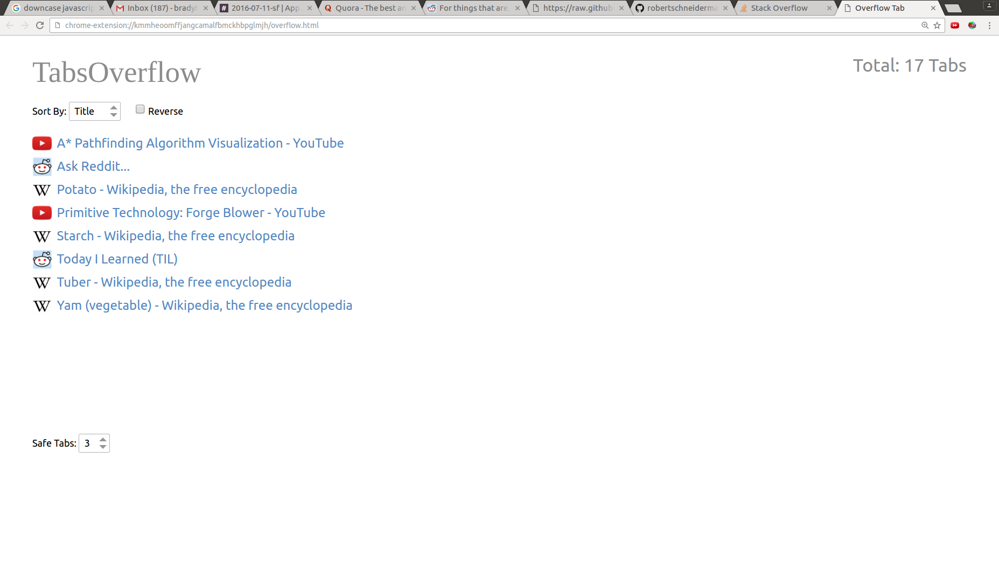
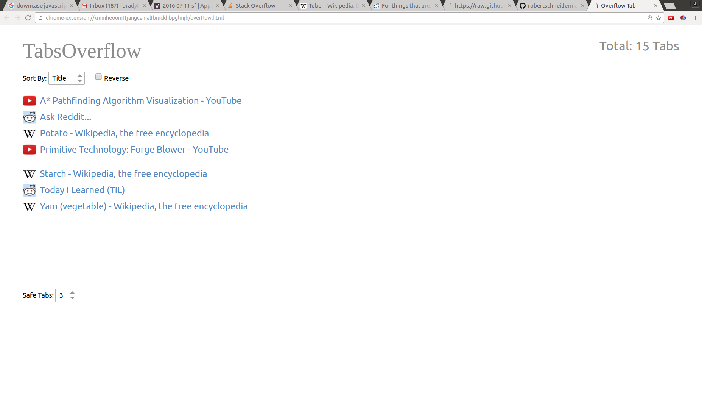
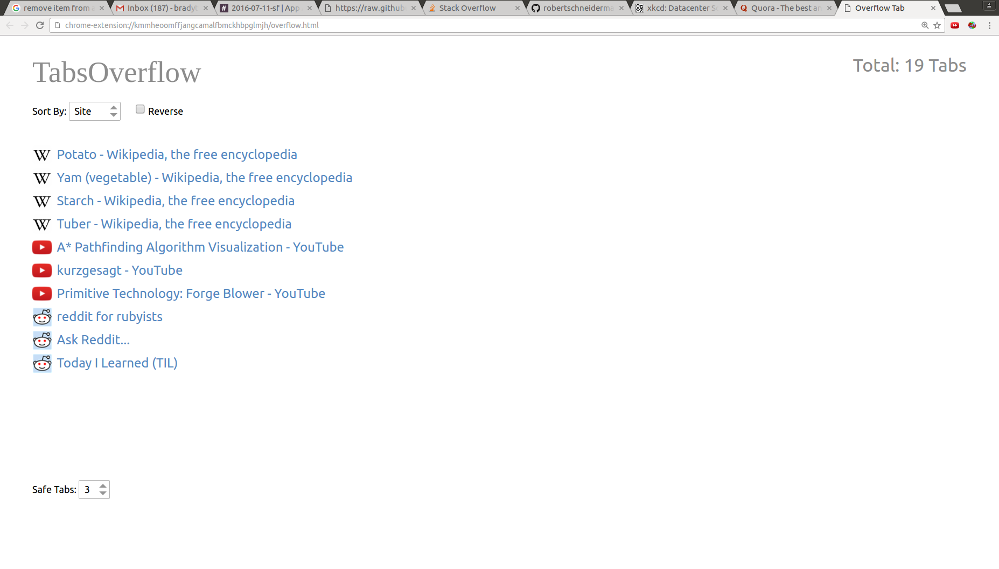

# Tabs Overflow

## Summary

### Overview

Tabs Overflow is a chrome extension which aims to make navigating with many tabs
open easier and quicker.  It does this by allowing the user to have 8 tabs open
at a time and selectively archiving any more than that into an 'overflow tab'
which holds links to the archived tabs.  Clicking on these links will open them,
archiving the next tab in line to make room.  Similarly, closing any tab will
pop open the last tab that was archived.  When enough tabs have been closed that
the overflow tab is no longer needed, it will politely close itself.

### Walkthrough

Our user has too many tabs open!  With three safe tabs, 5 cycling tabs,
and one overflow tab, his browser window looks like this:

Suppose that our user would like to read about tubers.  They click on the
'Wikipedia Tuber' link.  What happens next?  Since there are three safe tabs,
the tuber link is opened in the fourth tab. All subsequent tabs are pushed to
the right one.  The last tab before the overflow tab is then closed and pushed
into the overflow tab as a link, like so:

The user has finished reading all that they need in Quora and decide to kill the
tab.  This will ask the overflow tab to spit out the latest thing fed into it,
in this case Stack Overflow.  The window now looks like this:

Overall, as more tabs are opened, the cycle tabs are pushed to the right, with
the right-most one being collected into the overflow tab.  As tabs are closed,
tabs are pulled to the left, with a tab emerging from the overflow tab to fill
the gap.  In this way, tabs furthest to the left are usually newer, more important,
and furthest from being garbage collected, while the right tabs are older and
more prone to being archived.

## Features

### Sorting

By default, overflow links are grouped by
their site (All Reddit tabs will appear next to each other, and similarly for
Wikipedia, Stack Overflow, Youtube, or any other site), but the user may also
organize them by tab title or chronology.  Any of these sorting rules can be freely
reversed.

### Safe Tabs

Initially, the left three tabs will
never be archived, and so the user will move any tabs they wish to keep into those
spots.  If the user wants to save more (or less!) tabs, the number of safe tabs
can be adjusted through a drop down in the overflow tab.

### Quick Closing

Tabs may be removed from the overflow tab by clicking on an 'x' next to their
link if the user knows that they no longer need that link.  This will ensure that
the link is not automatically opened on another tabs closure.  If the user is sure
that they no longer need any of the links on the overflow tab, they can simply
close the tab to forget all of its contents.

###  Easier Hotkey Navigation

Having at most 9 tabs open (including the overflow) ensures that the user can
navigate to any tab with ctrl (or cmd) + num.  In addition, knowing that there
are exactly 9 tabs open lets the user easily identify tab number 8, for example.

## Known Issues

### Multiple Windows

Tabs Overflow has been designed with the assumption that the user will have only
one chrome window open at a time, and several strange and unintuitive interactions
occur when there are multiple windows open.  This will be addressed in a future
release.  For now, simply turn off the extension if you plan to open several windows.

### Archiving the Active Tab

It is currently possible for the extension to snatch the active tab and shove it
in the overflow tab if the active tab is in the 8th position.  To ensure that this
never happens, the user can keep a tab from which they expect to open many new tabs
in one of the safe tab slots.

### Repeated On/off

Repeatedly turning the extension on and off within the same browser session can
cause the user to lose some tabs.  As there is rarely a reason to do this, we
advise avoiding doing so until the bug can be found.

## Feedback

Feedback is greatly appreciated.  If you encounter any bugs or feel that the
project could use a different design or new feature, please feel free to
contact the authors at **emails**, or create an **issue**.
